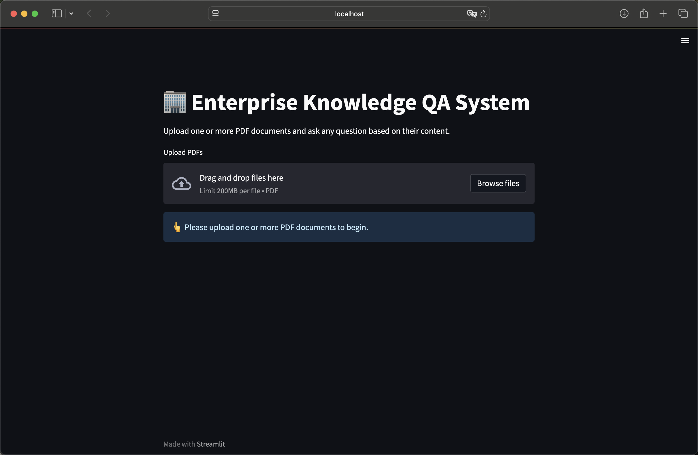
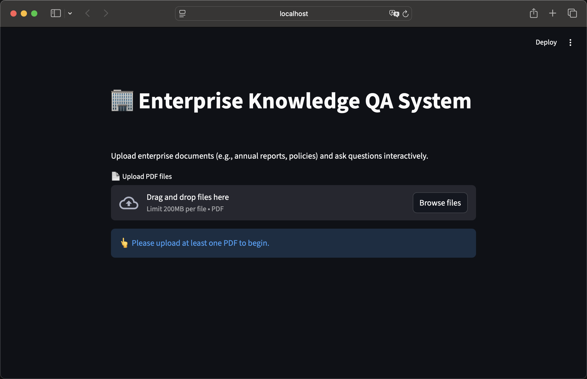
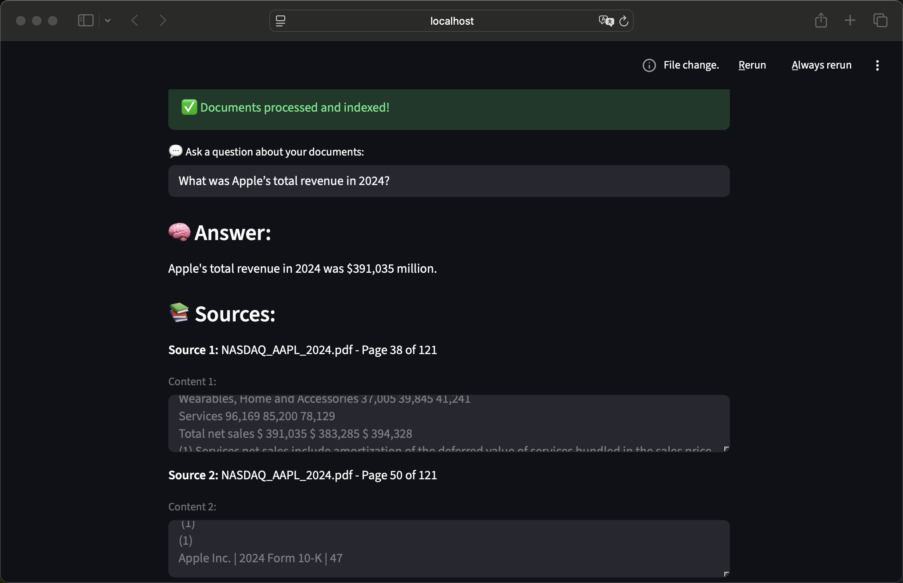
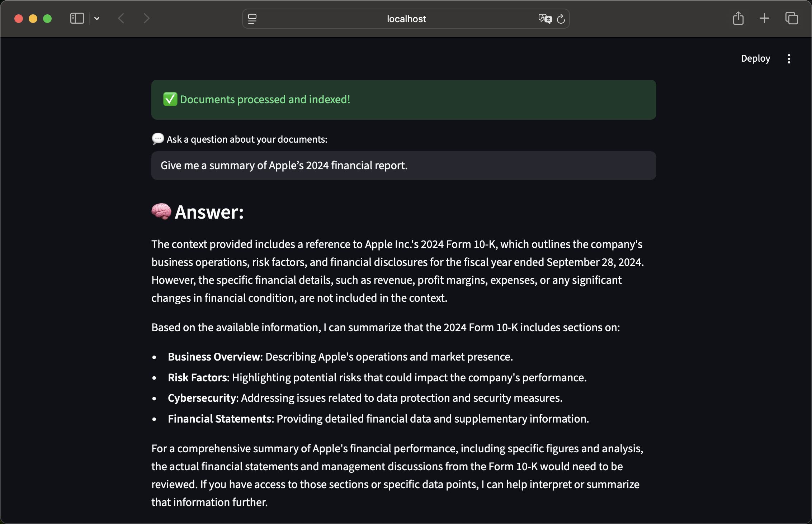
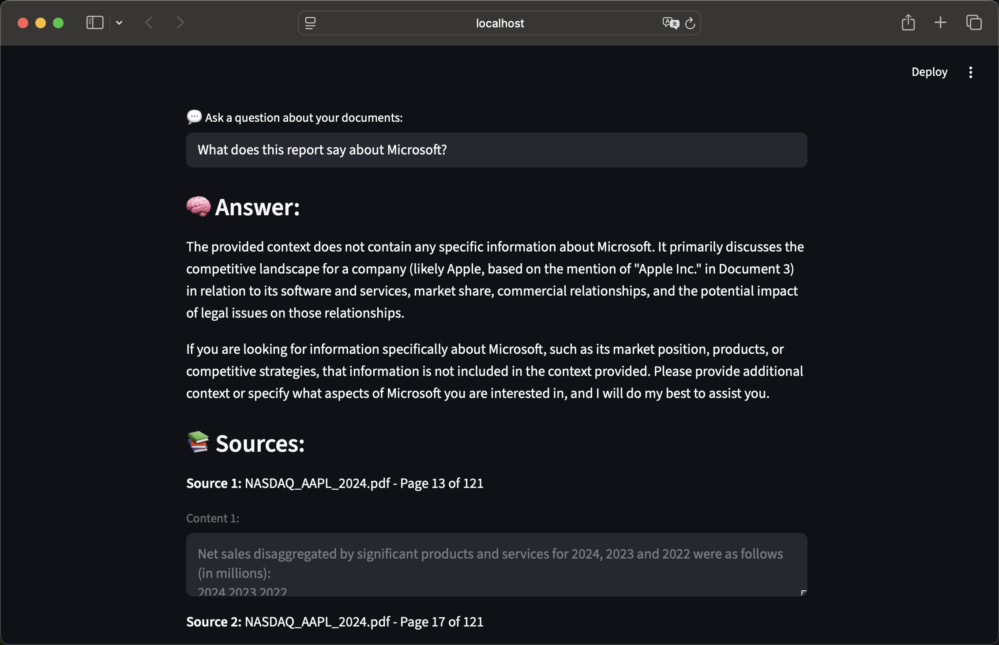

# 🏢 Enterprise Knowledge QA System

An **AI-powered document question-answering system** that allows users to upload enterprise documents (such as annual reports or policies), and interactively ask questions based on their content.

Users can upload one or more PDF documents and ask natural-language questions. 
Built with **Streamlit**, **LangChain**, **FAISS**, and **OpenAI models**, this system demonstrates how Retrieval-Augmented Generation (RAG) can transform unstructured corporate PDFs into an interactive, searchable knowledge base.


---

## 🚀 Features

✅ Upload multiple PDF documents  
✅ Extract and embed text content using **LangChain**  
✅ Perform vector search with **FAISS**  
✅ Generate context-aware answers using **OpenAI GPT models**  
✅ Display **page-accurate sources** for every answer  
✅ Beautiful, interactive UI built with **Streamlit**

---

## 📸 Demo

Below are screenshots showing the system in action:

| Step | Screenshot |
|------|-------------|
| 🏁 Upload PDFs |  |
| ⚙️ Documents Indexed |  |
| 💬 Example QA (Financial Data) |  |
| 📄 Example QA (Summary) |  |
| ❓ Context Check (Irrelevant Query) |  |

Each stage shows how the app:
- Processes and indexes PDFs  
- Retrieves relevant text chunks  
- Answers questions using GPT models  
- Provides accurate source references  

---

## 🧠 Example Questions to Try

### 📊 Financial & Data Extraction
- “What was Apple’s total revenue in 2024?”
- “How much did Apple spend on R&D?”
- “Summarize Apple’s 2024 financial performance.”

### 🧩 Reasoning & Comparison
- “How did Apple’s 2024 performance compare to 2023?”
- “What are the key risk factors mentioned in the report?”

### 💬 Summarization
- “Give me a summary of Apple’s 2024 financial report.”
- “List the main business units and their revenues.”

### ❓ Context Discrimination Test
- “What does this report say about Microsoft?”  
  (If the answer says *no relevant information found*, your RAG system is working perfectly 👏)

---

## 🏗️ Architecture Overview

```text
📁 PDF Upload
       ↓
🧩 Text Splitting (LangChain)
       ↓
🔍 Embedding + FAISS Indexing
       ↓
🧠 GPT Retrieval-Augmented QA
       ↓
🖥️ Streamlit Frontend
```
The system combines retrieval-based search with generation-based reasoning, forming a complete RAG pipeline optimized for enterprise document analysis.
---

## ⚙️ Setup and Run Locally
1️⃣ Clone the Repository
```
git clone https://github.com/huiwenxue122/Enterprise-Knowledge-QA-System-Clean.git
cd Enterprise-Knowledge-QA-System-Clean
```
2️⃣ Create Environment & Install Dependencies
```
python3 -m venv ekqs_env
source ekqs_env/bin/activate
pip install -r requirements.txt
```
3️⃣ Configure OpenAI API Key
Create a .env file in the project root:

```
OPENAI_API_KEY=sk-xxxxxxxxxxxxxxxxxxxxx
```
4️⃣ Run the App
```
streamlit run rag_app.py
```
Then open http://localhost:8501 in your browser.
---
## 📁 Project Structure
```
Enterprise-Knowledge-QA-System-Clean/
│
├── app/ or main file
│   └── rag_app.py            # Main Streamlit RAG application
│
├── data/                     # Sample PDF data
│   └── NASDAQ_AAPL_2024.pdf
│
├── faiss_index/              # Vector index storage (auto-created)
│
│
├── .env.example              # Example environment variables
├── requirements.txt
├── .gitignore
└── README.md
```
## 💡 Technologies Used


| Component | Technology |
|------------|-------------|
| Frontend | Streamlit |
| LLM | OpenAI GPT-4o-mini |
| Embeddings | OpenAI text-embedding-3-small |
| Document Loader | PyPDFLoader |
| Text Splitter | LangChain RecursiveCharacterTextSplitter |
| Vector Store | FAISS |
| Environment | Python 3.11 |
| Deployment | Localhost / Streamlit Cloud (optional) |


---
## ✨ Future Improvements
🧮 Support multiple LLM backends (Anthropic, Gemini, etc.)

🗂️ Add multi-user session support

🌐 Deploy on Streamlit Cloud or Hugging Face Spaces

📊 Add visual analytics for document insights
---

👩‍💻 Author
Claire Xue
Graduate Student | AI & NLP Enthusiast
📍 Based in the U.S. | Machine Learning Engineering and AI
🔗 GitHub Profile

🌟 If you like this project, please give it a ⭐ on GitHub!


